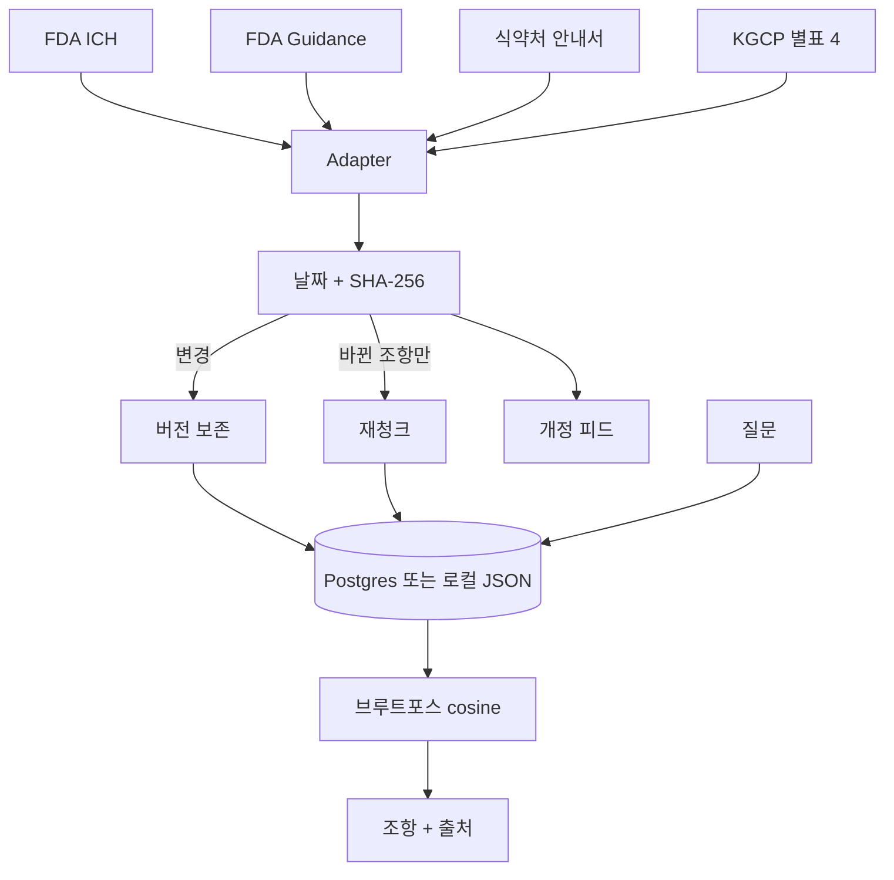

# GCP 가이드라인 검색기

EDC 프론트엔드를 만들다가, 필드 검증이나 감사추적이 **GCP·식약처 규정에 근거가 있는지** 매번 찾아 헤매던 문제를 줄이려고 만든 도구다.

검색창이 전부가 아니다. FDA·ICH·식약처·국가법령정보센터에 흩어진 가이드라인이 **언제 개정됐는지**를 먼저 따라가고, 그다음에 조항을 자연어로 묻는다.

---

## 배경

임상시험 데이터 시스템(EDC)에서 화면을 만들 때 이런 질문이 반복된다.

- 이 필드는 수정하면 감사추적을 남기는가?
- 전자서명은 Part 11 범위인가?
- 동의는 언제, 누구에게, 어떤 문서로 받아야 하는가?

규정은 한곳에 없다. FDA ICH, FDA 자체 가이던스, 식약처 민원인안내서, KGCP(법령 별표 4)가 사이트도 다르고 개정 주기도 다르다. 임상 실무자가 아닌 개발자 입장에서는 “구글에 검색 → PDF를 연다 → 예전에 본 버전이 맞나?”가 전부였다.

바뀐 줄을 사람이 매일 확인하는 게 검색보다 더 큰 낭비라고 봤다.

## 개요

이 저장소는 두 층이다.

1. **개정 감지 파이프라인** — 공개 목록을 가져와 제목/URL/고시일을 비교하고, PDF SHA-256이 바뀌면 개정이라도 날짜가 같아도 새 버전으로 남긴다. 바뀐 조항만 다시 자른다.
2. **조회 UI** — “감사추적에 누구·언제·왜를 남기나?”처럼 물으면 적재된 조항만 근거로 답하고, 문서명·조항·원문 링크를 붙인다.

우선순위는 고정이다. **개정 감지 > 답변 품질 > 화면.**

대상은 나(EDC 프론트 개발자)와, 나중에 쓸 CRA/RA 같은 주변 실무자다. 공식 유권해석이 아니고, 답 옆에 원문 링크를 두는 이유다.

## 목표

| 구간 | 내용 |
| --- | --- |
| 지금 | 핵심 문서 몇 종으로 파이프라인·검색·개정 피드를 끝까지 돌릴 것 |
| 다음 | **Vercel에 올려 실제 업무에 쓰기** (공개 URL) |
| 그다음 | 2–3주 로그를 본 뒤, 문제없으면 CRA/RA 커뮤니티에 공유 |

목표점은 “멋진 챗봇”이 아니다. **규정이 바뀌면 내가 알게 되고, 근거 조항을 30초 안에 다시 찾는 것**이다.

## 배포 — 한다. 다만 아직 안 했다

**배포할 프로젝트다.** 로컬 전용으로 끝낼 생각이 없다.

| 상태 | |
| --- | --- |
| GitHub 코드 | 있음. 이 레포 |
| 공개 사이트 (Vercel) | **아직 없음** |
| 이유 | OpenAI·Anthropic 키, Supabase, Vercel 프로젝트 연결이 남아 있음 |

공개 주소가 생기면 이 절 맨 위에 링크를 넣는다. 그때까지는 아래 로컬 실행으로만 쓸 수 있다.

배포 시 쓸 구성: Vercel(앱 + 매일 1회 Cron) · Supabase(Postgres) · 키는 콘솔에서 월 지출 한도를 건다.

## 지금까지의 성과

운영 트래픽 숫자는 공개 배포 전이라 없다. 코드로 확인한 것은 아래다.

- **시드 코퍼스 8문서 / 45청크** — ICH E6(R2), 전자시스템 Q&A, eSource, Part 11 적용범위, 위험기반 모니터링, Informed Consent, 식약처 ICH GCP 안내서, KGCP 별표 4
- **개정 판정** — 고시일 변경, 해시만 변경, 둘 다 아님을 테스트로 구분. 바뀐 조항만 재임베딩
- **벡터DB 없이 검색** — 1536차원 브루트포스 코사인 실측. 현재 규모 근사 100청크 **0.23ms**, 10만 청크 **242ms**. 5,000청크 또는 500ms를 넘기 전에는 pgvector를 안 쓴다. 표는 [`BENCHMARK.md`](BENCHMARK.md)
- **비용 가드** — IP당 하루 20회, 전체 200회, 같은 질문 캐시
- **답변 규칙** — 청크에 없으면 모른다고 함. 프롬프트 인젝션은 따라가지 않음

이력서용 정리: [`PORTFOLIO.md`](PORTFOLIO.md)

---

## 동작 구조



환경변수가 없으면 로컬 JSON과 시드 문서로 돈다. 키가 있으면 실제 임베딩·Haiku 답변을 쓴다.

## 출처

| 소스 | 범위 |
| --- | --- |
| [FDA ICH](https://www.fda.gov/science-research/clinical-trials-and-human-subject-protection/ich-guidance-documents) | v1은 E6(R2) |
| [FDA Clinical Trials Guidance](https://www.fda.gov/science-research/clinical-trials-and-human-subject-protection/clinical-trials-guidance-documents) | Part 11, eSource, 모니터링, 동의 등 |
| [식약처 민원인안내서](https://www.mfds.go.kr/brd/m_1060/list.do) | 임상시험 관련만. 게시판 전체 아님 |
| [국가법령정보센터](https://www.law.go.kr) | 의약품 등의 안전에 관한 규칙 **별표 4** (별표 1 GMP 아님) |

스캔본 PDF는 v1에서 OCR하지 않는다.

## 로컬에서 보기

```bash
npm install
cp .env.example .env.local
npm run dev          # http://127.0.0.1:43123
npm test
```

키 없이 시드 문서로 검색·개정 피드는 된다. 답변 품질을 올리려면 `OPENAI_API_KEY`, `ANTHROPIC_API_KEY`를 넣는다.

공개 배포를 할 때는 Vercel 환경변수에 위 키와 `SUPABASE_*`, `CRON_SECRET`을 넣고 `supabase/migrations/0001_init.sql`을 적용하면 된다.

## 개발 메모

단계별 구현 프롬프트는 [`docs/IMPLEMENTATION_PROMPTS.md`](docs/IMPLEMENTATION_PROMPTS.md). 에이전트가 끝낼 때마다 다른 모델이 `git diff`를 보는 Stop 훅은 `.claude/hooks/stop-review.mjs`.
