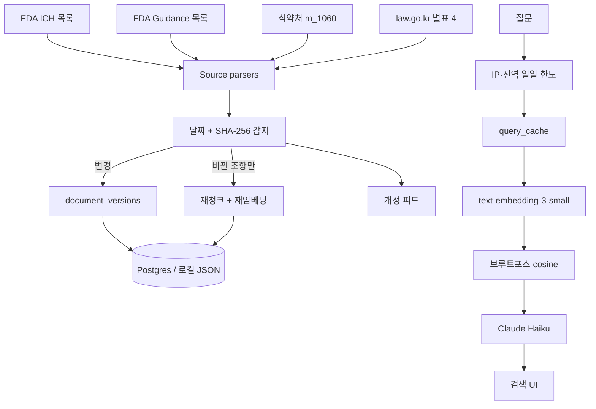

# GCP 가이드라인 검색기

FDA·ICH·식약처에 흩어진 임상시험 가이드라인의 **개정을 자동으로 감지·반영**하고, 그 결과를 자연어로 조회하는 도구입니다.

우선순위는 고정입니다: **개정 감지 파이프라인 > 검색/답변 품질 > UI**.

- Claude Code에 붙여 넣을 단계별 프롬프트: [`docs/IMPLEMENTATION_PROMPTS.md`](docs/IMPLEMENTATION_PROMPTS.md)
- 이력서/포트폴리오 STAR 정리: [`PORTFOLIO.md`](PORTFOLIO.md)
- 벡터DB 미사용 근거: [`BENCHMARK.md`](BENCHMARK.md)


## 아키텍처



배포는 Vercel Cron(매일 03:00 UTC) + Supabase(Postgres) 입니다. 환경변수가 없으면 `.data/store.json` 로컬 저장소와 시드 코퍼스로 동작합니다.

## 벡터DB를 쓰지 않는 이유

예상 청크 수는 수백 개입니다. `scripts/bench-cosine.ts` 가 100 / 1,000 / 10,000 / 100,000 규모에서 브루트포스 코사인 시간을 재고 `BENCHMARK.md` 에 기록합니다.

**pgvector 전환 조건** (코드 주석과 동일):

- 청크 수가 **5,000개**를 넘거나
- 유사도 계산만의 응답시간이 **500ms**를 초과하면

그때 HNSW 인덱스를 검토합니다. 그 전에는 `lib/retrieval/cosine.ts` 의 브루트포스가 검색 경로입니다.

## 로컬 실행

```bash
npm install
cp .env.example .env.local   # 키 없이도 시드 코퍼스 + mock embedding으로 검색 가능
npm run dev                  # http://127.0.0.1:43123
npm test
npm run bench                # BENCHMARK.md 갱신
```

| 스크립트 | 설명 |
| --- | --- |
| `npm run dev` | Next.js 개발 서버 (43123) |
| `npm test` | Vitest (파서, 감지, 코사인, 한도) |
| `npm run test:e2e` | Playwright (검색 → 답변 → 피드백) |
| `npm run bench` | 브루트포스 vs ANN 벤치마크 |
| `npm run admin:logs` | 로컬 검색 로그 출력 |
| `npm run seed` | 시드 코퍼스 재적재 |

Vercel 배포 시 `OPENAI_API_KEY`, `ANTHROPIC_API_KEY`, `SUPABASE_*`, `CRON_SECRET` 를 설정하고 `supabase/migrations/0001_init.sql` 을 적용합니다. OpenAI/Anthropic 콘솔에서 **월 지출 한도**를 걸어 두십시오.

## 데이터 소스

| 소스 | URL | 비고 |
| --- | --- | --- |
| FDA ICH | https://www.fda.gov/science-research/clinical-trials-and-human-subject-protection/ich-guidance-documents | v1은 E6(R2) 우선 |
| FDA Guidance | https://www.fda.gov/science-research/clinical-trials-and-human-subject-protection/clinical-trials-guidance-documents | Part 11, eSource, RBM, Informed Consent 등 |
| 식약처 | https://www.mfds.go.kr/brd/m_1060/list.do | 임상시험 관련 안내서만 |
| KGCP | https://www.law.go.kr | `의약품 등의 안전에 관한 규칙` **별표 4** (별표 1 GMP 아님) |

v1 OCR은 하지 않습니다. 스캔본은 `parse_status=needs_ocr` 로 남깁니다.

## 개정 감지

1. 스크래퍼가 목록을 다시 가져온다.
2. 새 URL/제목 → 신규.
3. 사이트 날짜가 저장된 값보다 최신 → `revised_date`.
4. PDF SHA-256 이 다르면 날짜가 같아도 → `revised_hash`.
5. 조항 단위 diff 후 **바뀐 조항만** 재임베딩한다.
6. Slack webhook 또는 로그로 관리자에게 알린다.

## Claude Code Stop 훅

`.claude/settings.json` 이 응답 종료 전 `.claude/hooks/stop-review.mjs` 를 실행합니다. Gemini(기본) 또는 GPT가 `git diff` 를 리뷰하고 심각하면 `{ "decision": "block", "reason": "..." }` 를 반환합니다. 결과는 `.claude/review-log.jsonl` 에 남습니다. API 키가 없으면 통과하고 로그만 남깁니다.
